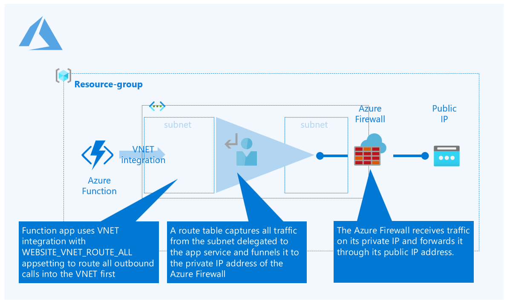

# Azure Function App with static outbound IP address

## Challenge
A 'typical' Azure function on an App Service plan, can have a number of outbound IP addresses when it makes outbound calls. This is documented [here](https://docs.microsoft.com/en-us/azure/azure-functions/ip-addresses) on the Azure Documentations page and you can find these IPs through either the portal or Azure CLI for instance:

```
az webapp show --resource-group <group_name> --name <app_name> --query outboundIpAddresses --output tsv
az webapp show --resource-group <group_name> --name <app_name> --query possibleOutboundIpAddresses --output tsv
```

Which will give you something like:

```
{
  "name": "AzureCloud.westeurope",
  "id": "AzureCloud.westeurope",
  "properties": {
    "changeNumber": 9,
    "region": "westeurope",
    "platform": "Azure",
    "systemService": "",
    "addressPrefixes": [
      "13.69.0.0/17",
      "13.73.128.0/18",
      ... Some IP addresses not shown here
     "213.199.180.192/27",
     "213.199.183.0/24"
    ]
  }
}
```
This can pose a challenge if the function tries to call a service that uses IP whitelisting. Objections I see at customers are the following:

  - Whitelisting a range can be cumbersome
  - If the functionapp is re-deployed and ends up on a different 'scale unit' in Azure, the range may be different
  - This is an IP range that is not solely used by *your* functionapp, it can be used by others. So for security this is sub-optimal.

So the documented solution to overcome this is to use an [App Service Environment (ASE)](https://docs.microsoft.com/en-us/azure/app-service/environment/network-info). This will host your app services and functions inside a VNET and so you can control the egress traffic of the VNET. If you proxy that trafic through a Network Virtual Appliance (NVA) you should be able to get a predictable, single and static public IP address. 

However, the ASE poses it's own set of challenges:

 - Provisioning time is typically slower and so is scaling
 - All public endpoints are removed from your apps and functions - so you have to find a solution for deployment
 - Same for your mangement consoles, streaming logs etc. etc. 

## Solution 
 And so I tried to look for a different solution and got the idea for the solution from [Dave Liefbroer](https://www.linkedin.com/in/dave-liefbroer-5b05091/?originalSubdomain=nl). Thanks Dave!

He proposed the following solution:




## How to deploy

The file `infra/deploy.azcli` contains a deployment script to provision the infrastructure yourself: 
[link](/infra). I would recommend to observe the following comment:

```
# Before you continue - I would suggest to find/replace the following
# 'prefix-'      - set it to your company/department or something, e.g. 'ms-csunl-jvw-' 
                  (NOTE: don't forget trailing dash)
# 'projectname'  - set it to the name of your project, e.g. 'publicipdemo'
# 'env'          - set it to a postfix of the resource-names, e.g. 'dev' 
```

